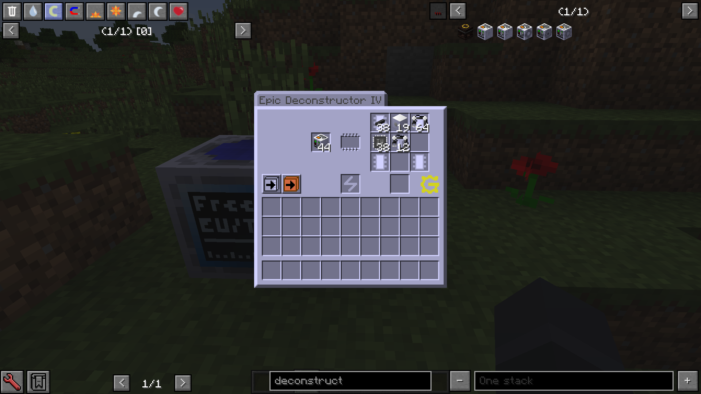
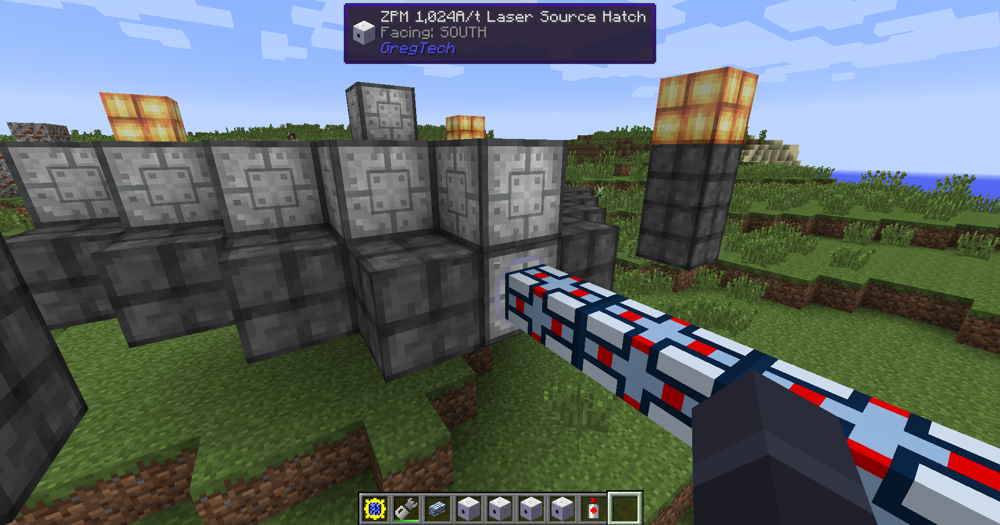

# 格雷新视野：憋鸡巴削了！

[English](README_EN.md)

回滚 GTNH 内容的模组，尤其是那些削弱某些机器的改动。

*我玩啥他削啥，这怎么玩！*

## 改动列表

### v1.0.0 (GTNH v2.3.3)

- [X] 回滚拆解机 (GTNewHorizons/GT5-Unofficial#1855)
- [X] 避雷针的铁栅栏不再会在发电时被破坏 (GTNewHorizons/GT5-Unofficial#1875)

### v1.1.0 (GTNH v2.3.6)

- [X] 大源质发电机（GoodGenerator）重新支持激光能源仓。

## FAQ

### 我希望能够回滚XXX？

你可以开启一个新的 Issue，附上能够找到的相关信息，尤其是该改动的 Pull Request 最佳。

### 怎么文字描述没变？

简而言之，因为懒。只修改代码逻辑部分相对简单，我懒得把时间浪费在改文本上，相信使用本模组的用户们应该也都是知道功能的。

## 感谢

第一次下载量达到四位数的模组，非常感谢大家的支持。
